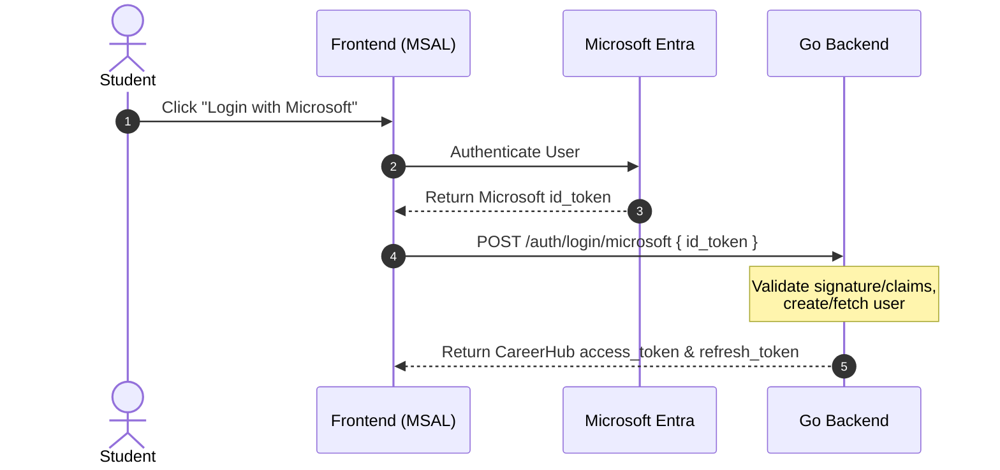
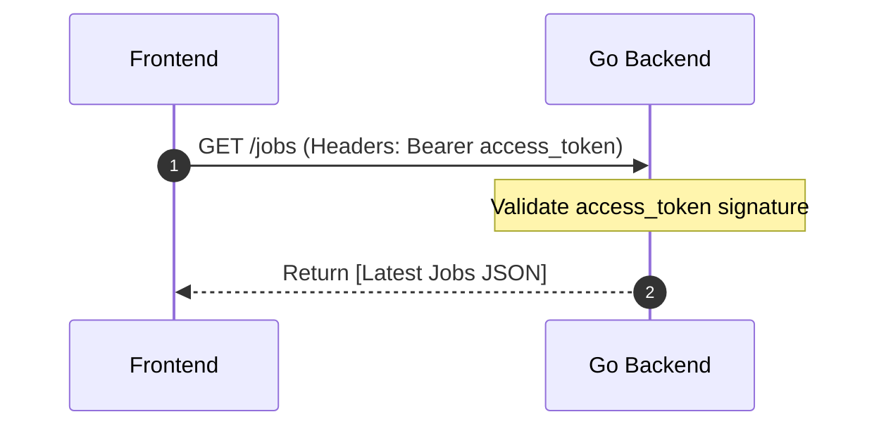
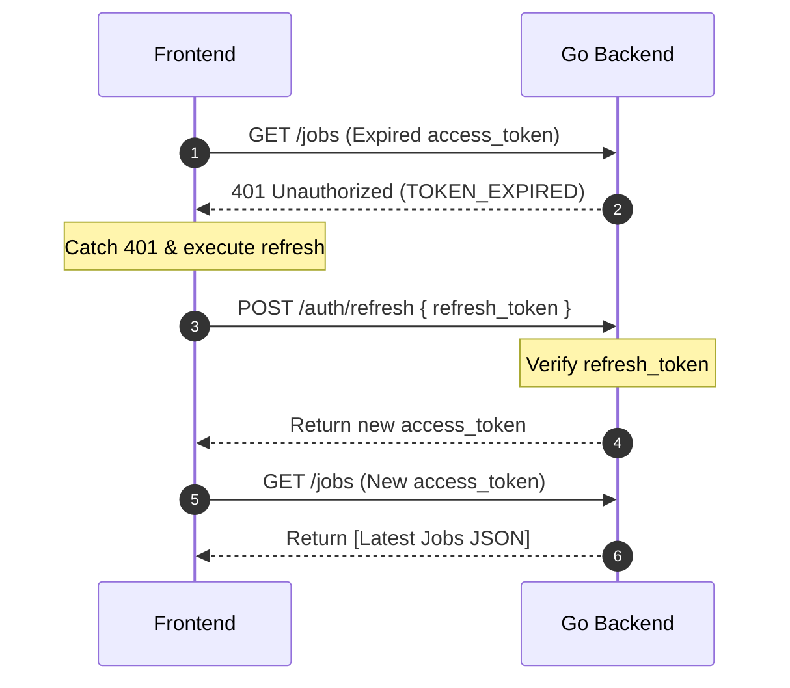

# CareerHubV2 Authentication Concepts & Token Flow

This document provides a clear, high-level explanation of how authentication, MSAL (Microsoft Authentication Library), and session tokens work together in **CareerHubV2**.

---

## 1. The Theme Park Analogy

To understand how the backend manages sessions without continuously checking in with Microsoft, consider this analogy:

```
[ Microsoft Entra ID ]              [ CareerHub Go Backend ]
  (Passport Office)                      (Theme Park Gates)
          │                                      │
          ▼                                      ▼
  1. Issues Passport (ID Token)   ──►  2. Verifies Passport & hands out:
                                          ├─ Wristband (Access Token - 1hr)
                                          └─ Claims Voucher (Refresh Token - 7d)
```

* **Microsoft Entra ID (The Passport Office):** Issues you a **Passport (`id_token`)** proving you are an active student.
* **The CareerHub Backend (The Theme Park Gates):** Checks your passport once at the door. If it is valid, they give you two local items:
  1. **Wristband (`access_token`):** A fast-check pass valid for **1 hour**. You show this on every ride (jobs, profile).
  2. **Claims Voucher (`refresh_token`):** A secure voucher kept in your pocket, valid for **7 days**.

---

## 2. Token Types Comparison

| Token | Issued By | Verified By | Lifespan | Primary Purpose |
| :--- | :--- | :--- | :--- | :--- |
| **Microsoft ID Token (`id_token`)** | Microsoft | CareerHub Backend | 1 hour | **Auth Verification:** Proves to the backend who you are so you can be logged in or auto-registered. Only used once per login session. |
| **CareerHub Access Token (`access_token`)** | CareerHub Backend | CareerHub Backend | 1 hour | **Resource Access:** Attached to the `Authorization: Bearer <token>` header of every API call to access protected student data. |
| **CareerHub Refresh Token (`refresh_token`)** | CareerHub Backend | CareerHub Backend | 7+ days | **Session Renewal:** Exchanged silently in the background for a new `access_token` once the current wristband expires. |

---

## 3. Step-by-Step Flow Workflows

### Flow A: Initial Sign-In (Passport Exchange)
1. **Frontend:** MSAL opens a Microsoft popup. The student logs in.
2. **Frontend:** MSAL receives a Microsoft `id_token`.
3. **Frontend:** Sends the `id_token` to the backend:  
   `POST /api/v1/auth/login/microsoft`
4. **Backend:** 
   * Fetches Microsoft's public keys (JWKS).
   * Verifies the token signature, audience (`aud`), and issuer (`iss`).
   * Automatically registers the user if they don't exist yet.
   * Generates a custom CareerHub `access_token` and `refresh_token`.
5. **Frontend:** Receives and stores the CareerHub tokens.



---

### Flow B: Accessing Protected Pages (Wristband Check)
1. **Frontend:** Student navigates to the Dashboard page.
2. **Frontend:** Requests jobs list, attaching the **Access Token** in the headers:  
   `Authorization: Bearer <access_token>`
3. **Backend:** Verifies the access token using its own secret key.
4. **Backend:** Returns the jobs database data.



---

### Flow C: Silent Token Refresh (Wristband Renewal)
1. **Frontend:** Attempts to fetch jobs using an expired **Access Token**.
2. **Backend:** Detects expiration and returns `401 Unauthorized (TOKEN_EXPIRED)`.
3. **Frontend:** Intercepts the `401` error. Before showing any error to the user, it calls:  
   `POST /api/v1/auth/refresh` with the **Refresh Token** in the payload.
4. **Backend:** Validates the refresh token. If valid, generates a **new access token**.
5. **Frontend:** Receives the new token and immediately retries the failed jobs request. The student experiences zero disruption.


