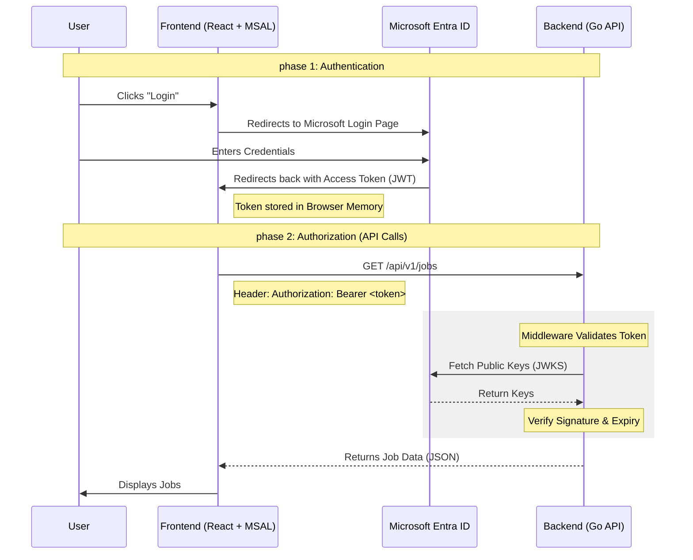

# Authentication Process: CareerHubV2

This document outlines how authentication works in CareerHubV2 using **Microsoft Entra ID** (formerly Azure AD). We use the industry-standard **OpenID Connect (OIDC)** flow.

## High-Level Flow

The following diagram illustrates the "handshake" between the User, Frontend, Microsoft, and the Backend.

---

## 1. Frontend Responsibilities (Colleague)
The frontend handles the "Phase 1" of the process using the `@azure/msal-react` library.

### Tasks:
- **MSAL Configuration**: Setup the `publicClientApplication` with the Client ID and Tenant ID.
- **Login Trigger**: Call `instance.loginRedirect()` to send the user to Microsoft.
- **Token Management**: Use `instance.acquireTokenSilent()` to get the Access Token before every API call.
- **Request Interceptor**: Attach the token to the `Authorization` header as a `Bearer` token.

---

## 2. Backend Responsibilities (You)
The backend handles "Phase 2"—validating the token sent by the frontend.

### Tasks:
- **Auth Middleware**: Create a function that runs before your API handlers.
- **Validation Steps**:
    1.  Extract the token from the `Authorization` header.
    2.  Validate the **Signature** using Microsoft's public keys.
    3.  Validate **Claims**:
        - `iss` (Issuer): Must be `https://login.microsoftonline.com/<tenant-id>/v2.0`.
        - `aud` (Audience): Must be your Client ID.
        - `exp` (Expiry): Must not be in the past.
- **Context Injection**: Store the user's details (email, name) in the Go `request.Context` for use in your business logic.

---

## 3. Configuration Requirements
Both developers will need these values from the Azure Portal:

| Variable | Description | Source |
| :--- | :--- | :--- |
| `TENANT_ID` | The unique ID of your Microsoft organization. | Azure Portal |
| `CLIENT_ID` | The Application ID for CareerHubV2. | Azure Portal |
| `REDIRECT_URI` | Where Microsoft sends the user after login. | `http://localhost:5173` |
| `SCOPES` | The permissions the app is asking for. | `openid`, `profile`, `User.Read` |

---

## 4. Working Independently (Mocking)
While the Backend is being built, the Frontend developer can use **MSW (Mock Service Worker)** to simulate successful and failed login/API states.

- **Mock Success**: Return a hardcoded JSON array of jobs.
- **Mock Failure**: Return a `401 Unauthorized` to test how the UI handles expired logins.

This ensures the Frontend developer is never "blocked" by Backend progress.
