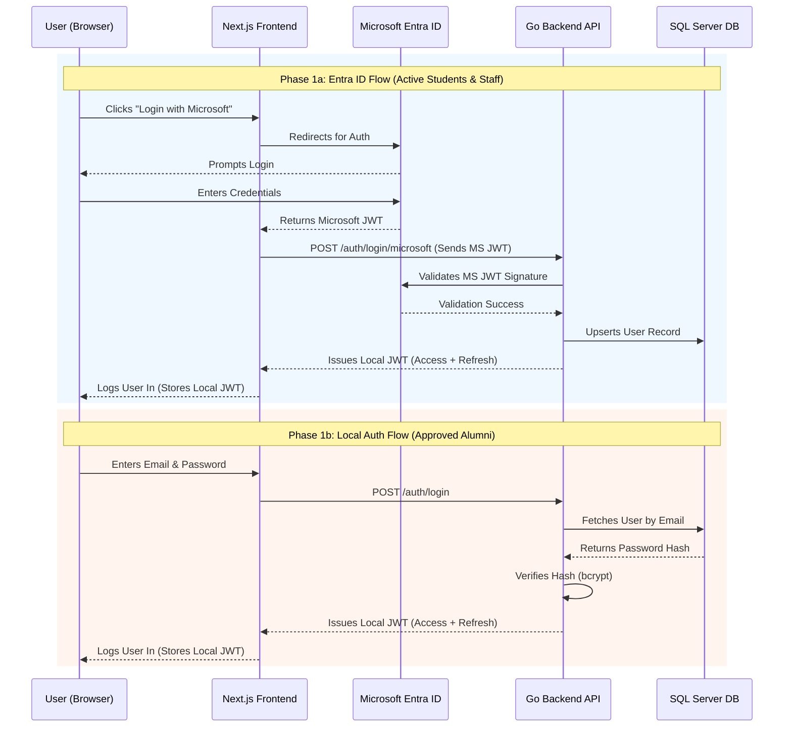

# Authentication Process: CareerHubV2

This document outlines how authentication works in CareerHubV2. The system uses a **Hybrid Authentication** model to support different user groups:
1. **Microsoft Entra ID**: Used for Active Students, SAC Department staff, and System Admins.
2. **Local Authentication**: Used for Alumni (old students) who do not have an active Microsoft account in our tenant.

---

## 1. Hybrid Authentication Strategy

The Backend API acts as the final authority on authentication by issuing its own **Local JWT** to *all* users, regardless of how they logged in. This simplifies API authorization.

- **Access Token Expiration:** 15 minutes (Best practice for short-lived access).
- **Refresh Token Expiration:** 7 days (Allows users to stay logged in without frequent re-authentication).

### Phase 1a: Entra ID Flow (Active Students & Staff)
1. User clicks "Login with Microsoft".
2. Frontend redirects to Microsoft Entra ID.
3. User logs in. Microsoft redirects back with a Microsoft JWT.
4. Frontend sends the Microsoft JWT to the Backend (`POST /auth/login/microsoft`).
5. Backend validates the Microsoft JWT.
6. Backend issues a **Local JWT** (Access + Refresh token) to the frontend.
7. If validation fails or access is revoked, frontend renders the Homepage with the custom **401 Unauthorized** error panel.

### Phase 1b: Local Auth Flow (Alumni)
**Registration:**
1. Alumni submit a registration form (Full Name, Student ID, Email). *Any valid email format is accepted.*
2. Account is created in `Pending` state.
3. SAC Department manually verifies the Student ID and Approves/Denies the request.
4. System emails the Alumni with the decision.

**Login:**
1. Approved Alumni enter Email and Password.
2. Frontend sends credentials to Backend (`POST /auth/login`).
3. Backend verifies password (bcrypt).
4. Backend issues a **Local JWT** (Access + Refresh token).
5. Unsuccessful login displays standard validation messages. Attempting to navigate directly to protected dashboard paths redirects to the **401 Unauthorized** Homepage state.

---

## 1c. Logout Confirmation Overlay Flow
To prevent accidental session termination, triggering "Log out" from the mobile navigation drawer does not immediately kill the session. Instead:
1. The frontend launches the designed **Logout Confirmation Popup** modal.
2. If confirmed, the local session and tokens are cleared, and the user is redirected back to the default sign-in Homepage state.

---

## 1d. Automatic Role Assignment & Bootstrap Admin
To avoid critical operational bottlenecks (like requiring admins to manually approve thousands of students or being locked out of the system upon fresh installation):

1. **Auto-Assignment & Domain Mapping Rules**:
   * When an Entra ID token is validated for a user logging in for the *first time*, the backend creates an account in the database (upsert).
   * **Student Domain (`@student.uow.edu.my`):** Automatically assigned `UserType = 'Student'`, `RegistrationStatus = 'N/A'`, and granted the **`Student` role** instantly. They are immediately directed to the search dashboard without manual approval.
   * **Staff Domain (`@uow.edu.my`):** Assigned `UserType = 'Staff'` and `RegistrationStatus = 'N/A'`, with **no default roles** (roles assigned manually by a System Admin).
   * **Other Domains:** Assigned `UserType = 'External'` and `RegistrationStatus = 'Pending'`, with **no default roles**.
2. **Bootstrap Admin Override (Cold Start Solution)**:
   * During server deployment, configure a secure OS/system environment variable: `BOOTSTRAP_ADMIN_EMAIL` (e.g., `admin@uow.edu.my`).
   * When an Entra ID user with a matching email logs in, the backend **automatically grants them the `System Admin` role** and sets `UserType = 'SystemAdmin'`.
   * This initial Admin user can then access `/admin/roles` and `/admin/users/{id}/roles` endpoints to delegate permissions and appoint other SAC staff or admins safely.

---

## 2. Password Setup & Reset Flow

To ensure a secure, effective, and user-friendly password reset process (used for both initial Alumni setup and forgotten passwords):

1. **Request Reset:** User requests a password reset via email.
2. **Generate Token:** Backend generates a cryptographically secure, random 32-byte token.
3. **Store Token:** Backend hashes the token and stores it in the `PasswordResets` database table with an expiration time (e.g., 1 hour).
4. **Send Email:** Backend emails a link containing the *raw* token (e.g., `https://careerhub/reset-password?token=abc123...`).
5. **Set Password:** User clicks the link, enters a new password, and submits.
6. **Verify & Update:** Backend hashes the incoming token, finds it in the DB, verifies it hasn't expired, updates the user's password (hashed with bcrypt), and deletes the reset token.

---

## 3. Frontend Responsibilities (Colleague)

### Tasks:
- **MSAL Configuration**: Setup the `publicClientApplication` for the Microsoft flow.
- **Login Forms**: Create a standard Email/Password form alongside the "Login with Microsoft" button.
- **Token Management**: Store the **Local JWT** (Access Token) in memory or a secure cookie, and handle the Refresh Token flow.
- **Request Interceptor**: Attach the Local JWT to the `Authorization` header as a `Bearer` token for all API calls.

---

## 4. Backend Responsibilities (You)

### Tasks:
- **Auth Middleware**: Create middleware that validates the **Local JWT** signature and expiration before allowing API access.
- **Entra ID Validation**: Validate Microsoft tokens (`iss`, `aud`, signature) before exchanging them for a Local JWT.
- **Password Management**: Use `bcrypt` to hash and verify Alumni passwords.
- **Context Injection**: Store user details (UserID, Roles) in the Go `request.Context` for Role-Based Access Control (RBAC).

---

## 5. Working Independently (Mocking)
While the Backend is being built, the Frontend developer can use **MSW (Mock Service Worker)** to simulate:
- `POST /auth/login/microsoft` (Returns a mock Local JWT)
- `POST /auth/login` (Returns a mock Local JWT)
- `POST /auth/register` (Returns success)
