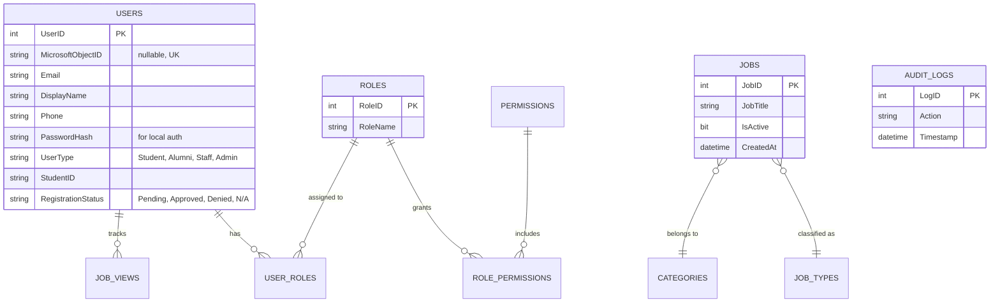

# Database Schema: CareerHubV2

This document defines the Microsoft SQL Server database structure for CareerHubV2, incorporating hybrid authentication, job listings, and Role-Based Access Control (RBAC).

## 1. Entity Relationship Diagram (Conceptual)

---

## 2. Table Definitions

### Table: `Users`
Stores user information for both Entra ID users and local Alumni.
- `UserID`: `INT IDENTITY(1,1) PRIMARY KEY`
- `MicrosoftObjectID`: `NVARCHAR(100) UNIQUE NULL` (Null for Alumni)
- `Email`: `NVARCHAR(255) UNIQUE NOT NULL`
- `PasswordHash`: `NVARCHAR(255) NULL` (Null for Entra ID users)
- `DisplayName`: `NVARCHAR(255)`
- `Phone`: `NVARCHAR(50) NULL`
- `UserType`: `NVARCHAR(50) NOT NULL` (e.g., 'ActiveStudent', 'Alumni', 'Staff', 'SystemAdmin')
- `StudentID`: `NVARCHAR(50) UNIQUE NULL` (Used for Alumni verification. Must be unique to prevent duplicates and registration spams)
- `RegistrationStatus`: `NVARCHAR(50) DEFAULT 'N/A'` (Pending, Approved, Denied)
- `CreatedAt`: `DATETIME DEFAULT GETDATE()`
- `LastLoginAt`: `DATETIME`

### Table: `PasswordResets`
Handles secure password setup and recovery.
- `ResetID`: `INT IDENTITY(1,1) PRIMARY KEY`
- `UserID`: `INT FOREIGN KEY REFERENCES Users(UserID)`
- `TokenHash`: `NVARCHAR(255) NOT NULL`
- `ExpiresAt`: `DATETIME NOT NULL`

### Table: `Roles` & `Permissions` (RBAC)
- **Roles**: `RoleID` (PK), `RoleName` (e.g., 'System Admin', 'SAC Department').
- **Permissions**: `PermissionID` (PK), `PermissionName` (e.g., 'manage_jobs', 'approve_alumni', 'manage_roles').
- **RolePermissions**: `RoleID` (FK), `PermissionID` (FK).
- **UserRoles**: `UserID` (FK), `RoleID` (FK).

### Table: `Jobs`
The primary table for job listings.
- `JobID`: `INT IDENTITY(1,1) PRIMARY KEY`
- `JobTitle`: `NVARCHAR(255) NOT NULL`
- `CompanyName`: `NVARCHAR(255) NOT NULL`
- `CategoryID`: `INT FOREIGN KEY REFERENCES Categories(CategoryID)`
- `JobTypeID`: `INT FOREIGN KEY REFERENCES JobTypes(JobTypeID)`
- `IsActive`: `BIT DEFAULT 1` (Allows SAC to hide jobs without deleting)
- `HasSalary`: `BIT DEFAULT 0`
- `SalaryMin`: `DECIMAL(18, 2) NULL`
- `SalaryMax`: `DECIMAL(18, 2) NULL`
- `Deadline`: `DATETIME NULL`
- `Location`: `NVARCHAR(255) NULL`
- `PositionCount`: `INT DEFAULT 1`
- `JobDescription`: `NVARCHAR(MAX)`
- `Responsibilities`: `NVARCHAR(MAX)`
- `Requirements`: `NVARCHAR(MAX)`
- `AdditionalInformation`: `NVARCHAR(MAX)`
- `HowToApply`: `NVARCHAR(MAX)`
- `CreatedAt`: `DATETIME DEFAULT GETDATE()` (Used to see how old the posting is)
- `UpdatedAt`: `DATETIME DEFAULT GETDATE()`

### Tables: `Categories` & `JobTypes`
- **Categories**: `CategoryID` (PK), `CategoryName`
- **JobTypes**: `JobTypeID` (PK), `TypeName`

### Table: `AuditLogs`
Tracks critical actions performed by users.
- `LogID`: `INT IDENTITY(1,1) PRIMARY KEY`
- `UserID`: `INT FOREIGN KEY REFERENCES Users(UserID) NULL`
- `Action`: `NVARCHAR(255) NOT NULL` (e.g., 'Approved Alumni', 'Deleted Job')
- `Resource`: `NVARCHAR(255) NOT NULL` (e.g., 'Users:123', 'Jobs:45')
- `Details`: `NVARCHAR(MAX) NULL` (Optional JSON string with before/after state)
- `Timestamp`: `DATETIME DEFAULT GETDATE()`
