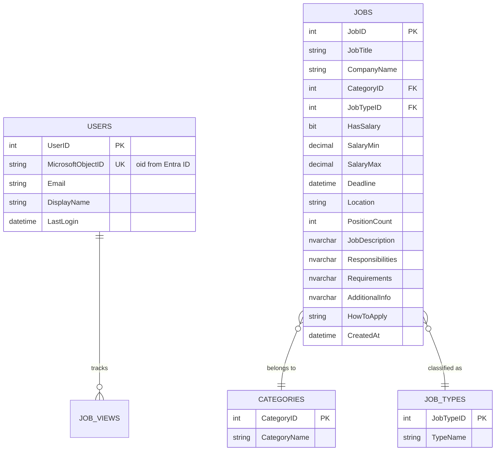

# Database Schema: CareerHubV2

This document defines the Microsoft SQL Server database structure for CareerHubV2, designed to handle job listings and user sessions.

## 1. Entity Relationship Diagram (Conceptual)

---

## 2. Table Definitions

### Table: `Categories`
Stores normalized job categories.
- `CategoryID`: `INT IDENTITY(1,1) PRIMARY KEY`
- `CategoryName`: `NVARCHAR(100) NOT NULL`

### Table: `JobTypes`
Stores normalized job types (e.g., Full-time, Internship).
- `JobTypeID`: `INT IDENTITY(1,1) PRIMARY KEY`
- `TypeName`: `NVARCHAR(50) NOT NULL`

### Table: `Jobs`
The primary table for job listings, mapped from `list.csv`.
- `JobID`: `INT IDENTITY(1,1) PRIMARY KEY`
- `JobTitle`: `NVARCHAR(255) NOT NULL`
- `CompanyName`: `NVARCHAR(255) NOT NULL`
- `CategoryID`: `INT FOREIGN KEY REFERENCES Categories(CategoryID)`
- `JobTypeID`: `INT FOREIGN KEY REFERENCES JobTypes(JobTypeID)`
- `HasSalary`: `BIT DEFAULT 0`
- `SalaryMin`: `DECIMAL(18, 2) NULL`
- `SalaryMax`: `DECIMAL(18, 2) NULL`
- `Deadline`: `DATETIME NULL`
- `Location`: `NVARCHAR(255) NULL`
- `PositionCount`: `INT DEFAULT 1`
- `JobDescription`: `NVARCHAR(MAX)`
- `Responsibilities`: `NVARCHAR(MAX)`
- `Requirements`: `NVARCHAR(MAX)`
- `AdditionalInformation`: `NVARCHAR(MAX)`
- `HowToApply`: `NVARCHAR(MAX)`
- `CreatedAt`: `DATETIME DEFAULT GETDATE()`
- `UpdatedAt`: `DATETIME DEFAULT GETDATE()`

### Table: `Users`
Stores user information synced from Microsoft Entra ID.
- `UserID`: `INT IDENTITY(1,1) PRIMARY KEY`
- `MicrosoftObjectID`: `NVARCHAR(100) UNIQUE NOT NULL` (The `oid` claim from JWT)
- `Email`: `NVARCHAR(255) NOT NULL`
- `DisplayName`: `NVARCHAR(255)`
- `CreatedAt`: `DATETIME DEFAULT GETDATE()`
- `LastLoginAt`: `DATETIME`

---

## 3. Recommended Indices
To ensure fast searching and filtering (especially for the search bar):
- **Full-Text Index**: On `JobTitle` and `JobDescription`.
- **Non-Clustered Index**: On `CategoryID`, `JobTypeID`, and `Location` for filtering performance.
